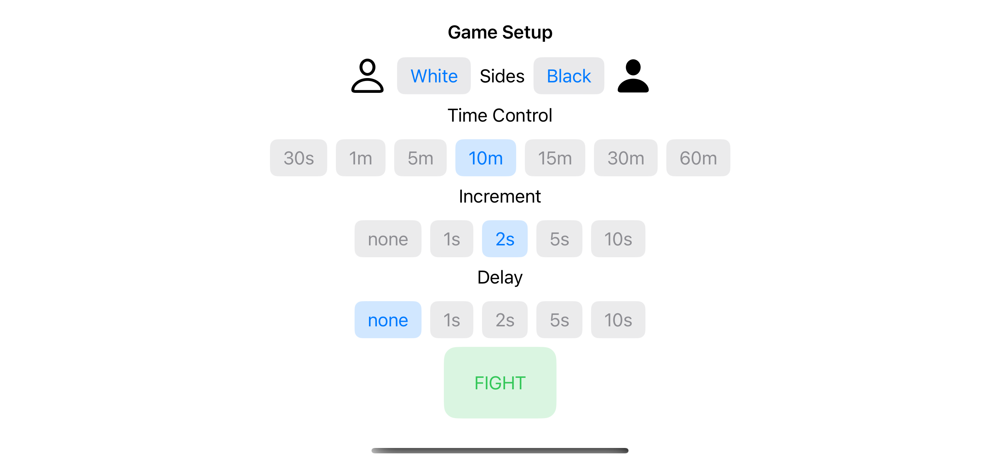
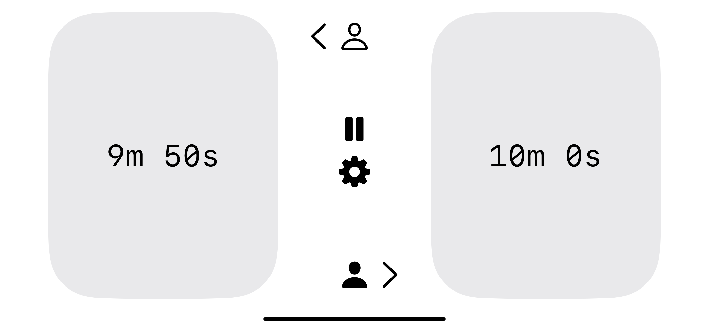

# ChessTimer
This is a working chess timer that I created to play chess with my daughter written in Swift/SwiftUI.  It currently has the minimal functionality required to setup games with common time controls, including increments and delays.  The app consists of two views.

### Setup View
This allows you to pick which side will play as white, the time each side gets and the increment or delay to be used.

### Content View
This includes buttons for both players with the time displayed in the middle.  It allows players to pause and resume the game.  It also will stop and indicate if a player flags

### Improvements
There are many improvements that could be made on this, which I hope to plug away at over time.
- Comment functions to improve readability
- Allow a method time edit time on the content view (in cases where an error has been made in the game)
- Allow for arbitrary time controls to be manually typed in.
- Dark mode option
- Controls should scale based on device type 
- Each click could be up to .1 second off based on how the timer counts down.  It should be relatively trivial to reduce that substantially.
- 

